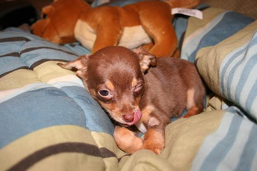
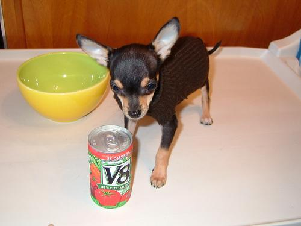
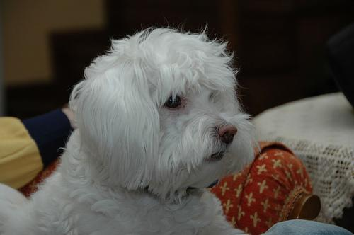
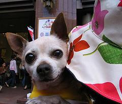
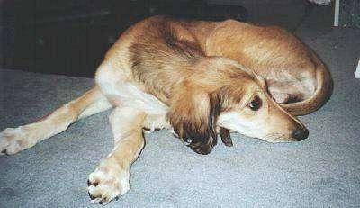
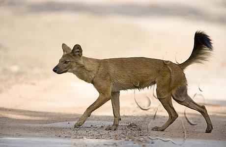

# Puppy Image Embeddings
An image compression model for dog images (rare puppers) that allows for similarity recognition and other semantic operations commonly associated with word embeddings. The model is composed of a SqueezeNet, with a few final layers spliced off and replaced with a set of dense layers trained in a Siamese architecture. In the examples provided in this repo, the dataset used is a breed classification corpus provided by [Stanford](http://vision.stanford.edu/aditya86/ImageNetDogs/).

This was my project for LAHacks - special thanks to the Baidu PaddlePaddle team.

(https://github.com/PaddlePaddle/models)


[](http://maintained.tech/)

## Requirements
You must have an AWS account and Docker-Machine installed on your computer. See Docker's documentation for [instructions](https://docs.docker.com/machine/install-machine/).
All other software will run inside an AWS EC2 instance, so you won't need any other software locally.

## Installation
These installation instructions assume you already have Docker-Machine installed on your computer.

First, provision a P2X EC2 on AWS using Docker Machine.
* Substitute your AWS credentials into `provision.sh`
* Ensure you configure a security group allowing for inbound traffic on port 8888 and update `provision.sh` accordingly. 
* `cd` into your project root (where this README is located)
* Run `bash provision.sh`

Then, you need to download the Corpus onto the new server. This line instructs the EC2 to fetch the dataset from Stanford's site.
`docker-machine ssh aws01 -- "sudo bash /home/ubuntu/utils/download_corpus.sh"`

Bring the remote ipynb online with:
```
docker-machine ssh aws01 -- "sudo nvidia-docker build -t notebookserver -f Dockerfile ."
docker-machine ssh aws01 -- "sudo nvidia-docker run --name=book -v=/home/ubuntu:/book/working -p 8888:8888 notebookserver"
```
Once the notebook is live, find the public ip of your machine (use `docker-machine ip aws01`) and visit `{ip}:8888` in a browser. You should have access to the ipynb now.
The final step is to build an index for the corpus:
```
docker-machine ssh aws01 -- "sudo nvidia-docker exec -t book python /book/working/src/generate_lists.py"
```

## Train
There are two models that need to be trained: the SqueezeNet model and the Siamese model. For these next steps, you'll want to ssh into the actual ec2 using `docker-machine ssh aws01`.

### Training SqueezeNet
First, train the SqueezeNet architecture on the supervised dog breed category dataset.
If you want to resume training from an existing parameters file, comment out line 27 of the `src/category_stage/train.py` file and update lines 28 and 29 accordingly. Otherwise, comment out line 28 and 29 and uncomment line 27.
Train the model like this:
```
sudo nvidia-docker exec -t book python /book/working/src/category_stage/train.py
```
Model saves will be found in `/book/working/models/`.

In order to continue to train the Siamese model, we will need to generate some intermediary embeddings. To do this, enter `src/category_stage/generate_embeddings.py` and update line 22 with your newest model save file.
Then, run:
```
sudo nvidia-docker exec -t book python /book/working/src/category_stage/generate_embeddings.py
```
This will generate a 'dataset' of sorts for the Siamese architecture to train on. This 'dataset' will be temporarily located in `/book/working/data/` as a Numpy save file.

### Siamese model
Once the SqueezeNet has been trained, you can train the Siamese model.
Train the model like this:
```
sudo nvidia-docker exec -t book python /book/working/src/siamese_stage/train.py
```
Nothing fancy needs to be done after this step.

## Usage
To access the final result, enter the notebook in `/book/working/src/main.ipynb`.
There should be examples of embedding manipulations there, including similarity measurement and puppy algebra.

## License

Copyright 2018 Eric Zhao

Permission is hereby granted, free of charge, to any person obtaining a copy of this software and associated documentation files (the "Software"), to deal in the Software without restriction, including without limitation the rights to use, copy, modify, merge, publish, distribute, sublicense, and/or sell copies of the Software, and to permit persons to whom the Software is furnished to do so, subject to the following conditions:

The above copyright notice and this permission notice shall be included in all copies or substantial portions of the Software.

THE SOFTWARE IS PROVIDED "AS IS", WITHOUT WARRANTY OF ANY KIND, EXPRESS OR IMPLIED, INCLUDING BUT NOT LIMITED TO THE WARRANTIES OF MERCHANTABILITY, FITNESS FOR A PARTICULAR PURPOSE AND NONINFRINGEMENT. IN NO EVENT SHALL THE AUTHORS OR COPYRIGHT HOLDERS BE LIABLE FOR ANY CLAIM, DAMAGES OR OTHER LIABILITY, WHETHER IN AN ACTION OF CONTRACT, TORT OR OTHERWISE, ARISING FROM, OUT OF OR IN CONNECTION WITH THE SOFTWARE OR THE USE OR OTHER DEALINGS IN THE SOFTWARE.

# Sample usage
From `src/main.ipynb`.


```python
%%capture

import paddle.v2 as paddle
import gzip
import numpy as np
import random

from category_stage import squeezenet
from siamese_stage import siamese, infer

from scipy.spatial.distance import cosine
import numpy as np

# Initialize PaddlePaddle.
paddle.init(use_gpu=False, trainer_count=1)

DATA_DIM = 3 * 128 * 128
CLASS_DIM = 120
BATCH_SIZE = 256

# Define input layers
image = paddle.layer.data(
    name="image", type=paddle.data_type.dense_vector(DATA_DIM))
lbl = paddle.layer.data(
    name="label", type=paddle.data_type.integer_value(CLASS_DIM))

# Configure the neural network.
out, intermediate = squeezenet(image, CLASS_DIM, True, True)
cost = paddle.layer.classification_cost(input=out, label=lbl)

with gzip.open('/book/working/models/params_pass_47.tar.gz', 'r') as f:
    parameters = paddle.parameters.Parameters.from_tar(f)
    
# Get data (or subsitute in your own!)
file_list = [line.strip().split("\t")[0] for line in open("/book/working/data/val.list")]
test_data = [(paddle.image.load_and_transform(image_file, 128 + 64, 128, False)
      .flatten().astype('float32'), )
     for image_file in file_list]

# Pseudo-batch data
batches = []
for i in range((len(test_data) / 100)):
    batches.append(test_data[i:i+100])
```

### Now lets load in our actual embeddings


```python
# Get intermediate embs from squeezenet
intermediate_embs = []
for batch in batches:
    intermediate_embs += list(paddle.infer(
        output_layer=intermediate,
        parameters=parameters,
        input=batch))

# Get final embeddings from Siamese
embs = infer.intermediate(np.array(intermediate_embs, dtype=np.float32))
```

## Example usage
Cool ways of using puppy embeddings. Most of these are analogous to word embedding operations.

### Similarity calculation

One really easy way of calculating the similarity of two dog images is simply calculating the euclidian distance between their embeddings. First we find the distance between these two dogs:





```python
# Here, we compare two pictures of chihuahuas.
print(file_list[0])
print(file_list[5])
# The distance between the chihuahuas is low: 0.1
print(cosine(embs[0], embs[5]))
```

    /book/working/data/Images/n02085620-Chihuahua/n02085620_2650.jpg
    /book/working/data/Images/n02085620-Chihuahua/n02085620_2517.jpg
    0.10574257373809814


The distance between those two dogs is very low: 0.105. This is because the dogs are similar.

Now, let's find the distance between these two dogs





```python
# Here we compare a chihuahua and a maltese dog.
print(file_list[5])
print(file_list[209])
# The distance between them is high: 0.7
print(cosine(embs[5], embs[209]))
```

    /book/working/data/Images/n02085620-Chihuahua/n02085620_2517.jpg
    /book/working/data/Images/n02085936-Maltese_dog/n02085936_13378.jpg
    0.7161149084568024


The distance between these two dogs is much higher than last time: 0.7. This is because the rare puppers look different.

### Puppy algebra

Now, we can apply algebra to puppies. For example, we will add two puppy pictures to get a puppy that looks similar to both. Here, we will add these two dogs:





```python
# We print the dogs' picture path.
print(file_list[1])
print(file_list[2047])
# We first add the two puppies embeddings together.
vector = embs[1] + embs[2047]
# We normalize the vector to norm1.
vector = vector / np.linalg.norm(vector)

# We find the closest image to the vector embedding.
min_dist = 1
best = None
for i, emb in enumerate(embs):
    if cosine(emb, vector) < min_dist:
        best = (i, emb)
        min_dist = cosine(emb, vector)

# We print the resulting dog's picture path.
print("Best match: " + file_list[best[0]])
# Print confidence score.
print(min_dist)
```

    /book/working/data/Images/n02085620-Chihuahua/n02085620_4919.jpg
    /book/working/data/Images/n02091831-Saluki/n02091831_648.jpg
    Best match: /book/working/data/Images/n02115913-dhole/n02115913_3991.jpg
    0.015775024890899658


As seen, the result of adding those two dogs gives us the dog at path `/book/working/data/Images/n02115913-dhole/n02115913_3991.jpg`. That path is this picture:



It's got the ears and the mouth of the chihuahua, and the sleek and brown body of the maltese dog.

